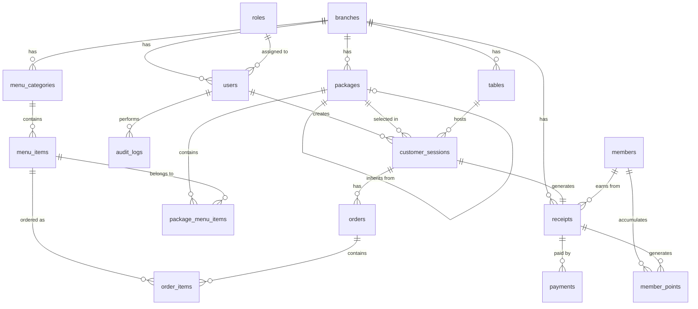

# Database Schema Documentation

## Entity Relationship Diagram (Mermaid)



## Table Definitions

### 1. Core Tables

#### branches
Restaurant branch information (multi-location support)

| Column | Type | Constraints | Description |
|--------|------|-------------|-------------|
| id | UUID | PRIMARY KEY | Branch unique identifier |
| name | VARCHAR(255) | NOT NULL | Branch name (Thai) |
| name_en | VARCHAR(255) | | Branch name (English) |
| address | TEXT | | Full address |
| phone | VARCHAR(20) | | Contact phone |
| is_active | BOOLEAN | DEFAULT true | Active status |
| created_at | TIMESTAMP | DEFAULT NOW() | Creation timestamp |
| updated_at | TIMESTAMP | DEFAULT NOW() | Last update timestamp |

#### roles
User role definitions

| Column | Type | Constraints | Description |
|--------|------|-------------|-------------|
| id | SERIAL | PRIMARY KEY | Role ID |
| name | VARCHAR(50) | UNIQUE NOT NULL | Role name (Admin, Staff, Cashier, Kitchen, Manager) |
| description | TEXT | | Role description |
| permissions | JSONB | | Permission flags |
| created_at | TIMESTAMP | DEFAULT NOW() | Creation timestamp |

**Default Roles:**
- Admin: Full system access
- Staff: Table & order management
- Cashier: Billing & receipts
- Kitchen: Order view & status update
- Manager: Reports & analytics (read-only)

#### users
System users (staff members)

| Column | Type | Constraints | Description |
|--------|------|-------------|-------------|
| id | UUID | PRIMARY KEY | User unique identifier |
| branch_id | UUID | FOREIGN KEY → branches(id) | Associated branch |
| role_id | INTEGER | FOREIGN KEY → roles(id) | User role |
| full_name | VARCHAR(255) | NOT NULL | Full name (Thai) |
| username | VARCHAR(100) | UNIQUE NOT NULL | Login username |
| password_hash | VARCHAR(255) | NOT NULL | Bcrypt hashed password |
| is_active | BOOLEAN | DEFAULT true | Account status |
| last_login | TIMESTAMP | | Last login time |
| created_at | TIMESTAMP | DEFAULT NOW() | Creation timestamp |
| updated_at | TIMESTAMP | DEFAULT NOW() | Last update timestamp |

---

### 2. Package & Menu System

#### packages
Buffet package definitions (Silver, Gold, Platinum, etc.)

| Column | Type | Constraints | Description |
|--------|------|-------------|-------------|
| id | UUID | PRIMARY KEY | Package unique identifier |
| branch_id | UUID | FOREIGN KEY → branches(id) | Associated branch |
| parent_package_id | UUID | FOREIGN KEY → packages(id) NULL | Parent package for inheritance |
| name | VARCHAR(100) | NOT NULL | Package name (e.g., "Gold Buffet") |
| name_en | VARCHAR(100) | | English name |
| description | TEXT | | Package description |
| color_hex | VARCHAR(7) | DEFAULT '#000000' | Display color (e.g., #FFD700 for gold) |
| price_adult | DECIMAL(10,2) | NOT NULL | Price per adult (THB) |
| price_child | DECIMAL(10,2) | NOT NULL | Price per child (THB) |
| time_limit_minutes | INTEGER | | Time limit in minutes (e.g., 90, 120) |
| sort_order | INTEGER | DEFAULT 0 | Display order |
| is_active | BOOLEAN | DEFAULT true | Active status |
| created_at | TIMESTAMP | DEFAULT NOW() | Creation timestamp |
| updated_at | TIMESTAMP | DEFAULT NOW() | Last update timestamp |

**Package Inheritance Logic:**
- If `parent_package_id` is NULL, package has only its own menus
- If `parent_package_id` is set, package inherits all menus from parent + its own
- Example: Gold (parent: Silver), Platinum (parent: Gold)

#### menu_categories
Menu item categories

| Column | Type | Constraints | Description |
|--------|------|-------------|-------------|
| id | UUID | PRIMARY KEY | Category unique identifier |
| branch_id | UUID | FOREIGN KEY → branches(id) | Associated branch |
| name | VARCHAR(100) | NOT NULL | Category name (e.g., "ย่าง", "ทอด") |
| name_en | VARCHAR(100) | | English name |
| icon | VARCHAR(50) | | Icon identifier |
| sort_order | INTEGER | DEFAULT 0 | Display order |
| is_active | BOOLEAN | DEFAULT true | Active status |
| created_at | TIMESTAMP | DEFAULT NOW() | Creation timestamp |

#### menu_items
Food and beverage menu items

| Column | Type | Constraints | Description |
|--------|------|-------------|-------------|
| id | UUID | PRIMARY KEY | Menu item unique identifier |
| category_id | UUID | FOREIGN KEY → menu_categories(id) | Category |
| name | VARCHAR(255) | NOT NULL | Menu item name (Thai) |
| name_en | VARCHAR(255) | | English name |
| description | TEXT | | Item description |
| image_url | VARCHAR(500) | | Image file path/URL |
| price_standalone | DECIMAL(10,2) | DEFAULT 0 | Price if ordered outside package |
| cost | DECIMAL(10,2) | | Cost for profit calculation |
| is_available | BOOLEAN | DEFAULT true | Currently available |
| is_out_of_stock | BOOLEAN | DEFAULT false | Temporarily out of stock |
| allergen_info | JSONB | | Allergen information |
| tags | JSONB | | Tags (spicy, vegetarian, etc.) |
| sort_order | INTEGER | DEFAULT 0 | Display order |
| created_at | TIMESTAMP | DEFAULT NOW() | Creation timestamp |
| updated_at | TIMESTAMP | DEFAULT NOW() | Last update timestamp |

#### package_menu_items
Many-to-many mapping between packages and menu items

| Column | Type | Constraints | Description |
|--------|------|-------------|-------------|
| id | UUID | PRIMARY KEY | Mapping unique identifier |
| package_id | UUID | FOREIGN KEY → packages(id) | Package |
| menu_item_id | UUID | FOREIGN KEY → menu_items(id) | Menu item |
| created_at | TIMESTAMP | DEFAULT NOW() | Creation timestamp |

**UNIQUE constraint:** (package_id, menu_item_id)

---

### 3. Table & Session Management

#### tables
Restaurant tables

| Column | Type | Constraints | Description |
|--------|------|-------------|-------------|
| id | UUID | PRIMARY KEY | Table unique identifier |
| branch_id | UUID | FOREIGN KEY → branches(id) | Associated branch |
| table_number | VARCHAR(20) | NOT NULL | Table number/name |
| zone | VARCHAR(50) | | Zone/section (e.g., "ชั้น 1", "VIP") |
| capacity | INTEGER | DEFAULT 4 | Number of seats |
| status | VARCHAR(20) | DEFAULT 'available' | available, occupied, billing, disabled |
| qr_code_url | VARCHAR(500) | | QR code image URL |
| created_at | TIMESTAMP | DEFAULT NOW() | Creation timestamp |
| updated_at | TIMESTAMP | DEFAULT NOW() | Last update timestamp |

**UNIQUE constraint:** (branch_id, table_number)

#### customer_sessions
Customer dining sessions

| Column | Type | Constraints | Description |
|--------|------|-------------|-------------|
| id | UUID | PRIMARY KEY | Session unique identifier |
| table_id | UUID | FOREIGN KEY → tables(id) | Table |
| package_id | UUID | FOREIGN KEY → packages(id) | Selected package |
| created_by_user_id | UUID | FOREIGN KEY → users(id) | Staff who created session |
| num_adults | INTEGER | DEFAULT 0 | Number of adults |
| num_children | INTEGER | DEFAULT 0 | Number of children |
| start_time | TIMESTAMP | NOT NULL | Session start time |
| end_time | TIMESTAMP | | Session end time (when closed) |
| time_limit_minutes | INTEGER | | Time limit for this session |
| status | VARCHAR(20) | DEFAULT 'active' | active, completed, cancelled |
| notes | TEXT | | Additional notes |
| created_at | TIMESTAMP | DEFAULT NOW() | Creation timestamp |
| updated_at | TIMESTAMP | DEFAULT NOW() | Last update timestamp |

---

### 4. Order Management

#### orders
Customer orders during a session

| Column | Type | Constraints | Description |
|--------|------|-------------|-------------|
| id | UUID | PRIMARY KEY | Order unique identifier |
| session_id | UUID | FOREIGN KEY → customer_sessions(id) | Customer session |
| order_number | VARCHAR(50) | | Human-readable order number |
| status | VARCHAR(20) | DEFAULT 'new' | new, accepted, in_progress, served, cancelled |
| updated_by_user_id | UUID | FOREIGN KEY → users(id) | Last user who updated status |
| notes | TEXT | | Customer notes/special requests |
| created_at | TIMESTAMP | DEFAULT NOW() | Order time |
| updated_at | TIMESTAMP | DEFAULT NOW() | Last status update |

#### order_items
Individual items in an order

| Column | Type | Constraints | Description |
|--------|------|-------------|-------------|
| id | UUID | PRIMARY KEY | Order item unique identifier |
| order_id | UUID | FOREIGN KEY → orders(id) | Parent order |
| menu_item_id | UUID | FOREIGN KEY → menu_items(id) | Menu item |
| quantity | INTEGER | NOT NULL | Quantity ordered |
| unit_price | DECIMAL(10,2) | DEFAULT 0 | Price per unit (if charged extra) |
| notes | TEXT | | Item-specific notes |
| created_at | TIMESTAMP | DEFAULT NOW() | Creation timestamp |

---

### 5. Billing & Receipts

#### receipts
Payment receipts

| Column | Type | Constraints | Description |
|--------|------|-------------|-------------|
| id | UUID | PRIMARY KEY | Receipt unique identifier |
| branch_id | UUID | FOREIGN KEY → branches(id) | Branch |
| session_id | UUID | FOREIGN KEY → customer_sessions(id) | Customer session |
| member_id | UUID | FOREIGN KEY → members(id) NULL | Member (if applicable) |
| receipt_number | VARCHAR(50) | UNIQUE NOT NULL | Receipt number (e.g., "R20231130-0001") |
| subtotal | DECIMAL(10,2) | NOT NULL | Amount before VAT/service charge |
| service_charge_percent | DECIMAL(5,2) | DEFAULT 0 | Service charge % |
| service_charge_amount | DECIMAL(10,2) | DEFAULT 0 | Service charge amount |
| vat_percent | DECIMAL(5,2) | DEFAULT 0 | VAT % |
| vat_amount | DECIMAL(10,2) | DEFAULT 0 | VAT amount |
| discount_percent | DECIMAL(5,2) | DEFAULT 0 | Discount % |
| discount_amount | DECIMAL(10,2) | DEFAULT 0 | Discount amount |
| discount_reason | TEXT | | Reason for discount |
| points_used | INTEGER | DEFAULT 0 | Loyalty points used |
| points_value | DECIMAL(10,2) | DEFAULT 0 | Value of points used (THB) |
| grand_total | DECIMAL(10,2) | NOT NULL | Final amount |
| created_by_user_id | UUID | FOREIGN KEY → users(id) | Cashier |
| created_at | TIMESTAMP | DEFAULT NOW() | Receipt timestamp |

#### payments
Payment records

| Column | Type | Constraints | Description |
|--------|------|-------------|-------------|
| id | UUID | PRIMARY KEY | Payment unique identifier |
| receipt_id | UUID | FOREIGN KEY → receipts(id) | Associated receipt |
| payment_method | VARCHAR(50) | NOT NULL | cash, transfer, qr_promptpay, card |
| amount | DECIMAL(10,2) | NOT NULL | Payment amount |
| reference_number | VARCHAR(100) | | Transaction reference |
| created_at | TIMESTAMP | DEFAULT NOW() | Payment timestamp |

---

### 6. Loyalty Program

#### members
Customer membership

| Column | Type | Constraints | Description |
|--------|------|-------------|-------------|
| id | UUID | PRIMARY KEY | Member unique identifier |
| member_code | VARCHAR(50) | UNIQUE NOT NULL | Member code (e.g., "M000001") |
| name | VARCHAR(255) | NOT NULL | Member name |
| phone | VARCHAR(20) | UNIQUE NOT NULL | Phone number |
| email | VARCHAR(255) | | Email address |
| line_id | VARCHAR(100) | | Line ID |
| birthdate | DATE | | Date of birth |
| total_points | INTEGER | DEFAULT 0 | Current points balance |
| total_visits | INTEGER | DEFAULT 0 | Total number of visits |
| total_spent | DECIMAL(10,2) | DEFAULT 0 | Total lifetime spending |
| created_at | TIMESTAMP | DEFAULT NOW() | Registration date |
| updated_at | TIMESTAMP | DEFAULT NOW() | Last update timestamp |

#### member_points
Points transaction history

| Column | Type | Constraints | Description |
|--------|------|-------------|-------------|
| id | UUID | PRIMARY KEY | Transaction unique identifier |
| member_id | UUID | FOREIGN KEY → members(id) | Member |
| receipt_id | UUID | FOREIGN KEY → receipts(id) NULL | Related receipt (if applicable) |
| points_change | INTEGER | NOT NULL | Points added (positive) or used (negative) |
| reason | VARCHAR(100) | NOT NULL | earn_purchase, redeem_discount, birthday_bonus, etc. |
| description | TEXT | | Additional description |
| balance_after | INTEGER | NOT NULL | Points balance after this transaction |
| created_at | TIMESTAMP | DEFAULT NOW() | Transaction timestamp |

---

### 7. Settings

#### settings
System configuration

| Column | Type | Constraints | Description |
|--------|------|-------------|-------------|
| id | SERIAL | PRIMARY KEY | Setting ID |
| branch_id | UUID | FOREIGN KEY → branches(id) NULL | Branch-specific (NULL = global) |
| key | VARCHAR(100) | NOT NULL | Setting key |
| value | TEXT | NOT NULL | Setting value (JSON for complex values) |
| data_type | VARCHAR(20) | DEFAULT 'string' | string, number, boolean, json |
| description | TEXT | | Setting description |
| updated_at | TIMESTAMP | DEFAULT NOW() | Last update timestamp |

**UNIQUE constraint:** (branch_id, key)

**Example Settings:**
- `restaurant_name`: "ร้านบุฟเฟ่ต์สุขใจ"
- `vat_percent`: "7"
- `service_charge_percent`: "10"
- `loyalty_points_per_baht`: "0.01" (1 point per 100 THB)
- `loyalty_points_value`: "1" (1 point = 1 THB)

---

### 8. Audit Logging

#### audit_logs
System activity audit trail

| Column | Type | Constraints | Description |
|--------|------|-------------|-------------|
| id | UUID | PRIMARY KEY | Log unique identifier |
| user_id | UUID | FOREIGN KEY → users(id) NULL | User who performed action |
| action | VARCHAR(100) | NOT NULL | Action type (e.g., "create_session", "close_bill") |
| entity_type | VARCHAR(50) | | Entity affected (e.g., "customer_session") |
| entity_id | UUID | | ID of affected entity |
| old_values | JSONB | | Previous values (for updates) |
| new_values | JSONB | | New values |
| ip_address | VARCHAR(45) | | User IP address |
| user_agent | TEXT | | User agent string |
| created_at | TIMESTAMP | DEFAULT NOW() | Action timestamp |

---

## SQL DDL Example

```sql
-- Create extensions
CREATE EXTENSION IF NOT EXISTS "uuid-ossp";

-- 1. Branches
CREATE TABLE branches (
    id UUID PRIMARY KEY DEFAULT uuid_generate_v4(),
    name VARCHAR(255) NOT NULL,
    name_en VARCHAR(255),
    address TEXT,
    phone VARCHAR(20),
    is_active BOOLEAN DEFAULT true,
    created_at TIMESTAMP DEFAULT CURRENT_TIMESTAMP,
    updated_at TIMESTAMP DEFAULT CURRENT_TIMESTAMP
);

-- 2. Roles
CREATE TABLE roles (
    id SERIAL PRIMARY KEY,
    name VARCHAR(50) UNIQUE NOT NULL,
    description TEXT,
    permissions JSONB,
    created_at TIMESTAMP DEFAULT CURRENT_TIMESTAMP
);

-- Insert default roles
INSERT INTO roles (name, description, permissions) VALUES
('Admin', 'Full system access', '{"all": true}'::jsonb),
('Staff', 'Table and order management', '{"tables": true, "orders": true}'::jsonb),
('Cashier', 'Billing and receipts', '{"billing": true, "receipts": true}'::jsonb),
('Kitchen', 'Order view and status', '{"orders": "read_update"}'::jsonb),
('Manager', 'Reports and analytics', '{"reports": true}'::jsonb);

-- 3. Users
CREATE TABLE users (
    id UUID PRIMARY KEY DEFAULT uuid_generate_v4(),
    branch_id UUID REFERENCES branches(id) ON DELETE CASCADE,
    role_id INTEGER REFERENCES roles(id) ON DELETE RESTRICT,
    full_name VARCHAR(255) NOT NULL,
    username VARCHAR(100) UNIQUE NOT NULL,
    password_hash VARCHAR(255) NOT NULL,
    is_active BOOLEAN DEFAULT true,
    last_login TIMESTAMP,
    created_at TIMESTAMP DEFAULT CURRENT_TIMESTAMP,
    updated_at TIMESTAMP DEFAULT CURRENT_TIMESTAMP
);

-- 4. Packages
CREATE TABLE packages (
    id UUID PRIMARY KEY DEFAULT uuid_generate_v4(),
    branch_id UUID REFERENCES branches(id) ON DELETE CASCADE,
    parent_package_id UUID REFERENCES packages(id) ON DELETE SET NULL,
    name VARCHAR(100) NOT NULL,
    name_en VARCHAR(100),
    description TEXT,
    color_hex VARCHAR(7) DEFAULT '#000000',
    price_adult DECIMAL(10,2) NOT NULL,
    price_child DECIMAL(10,2) NOT NULL,
    time_limit_minutes INTEGER,
    sort_order INTEGER DEFAULT 0,
    is_active BOOLEAN DEFAULT true,
    created_at TIMESTAMP DEFAULT CURRENT_TIMESTAMP,
    updated_at TIMESTAMP DEFAULT CURRENT_TIMESTAMP
);

-- 5. Menu Categories
CREATE TABLE menu_categories (
    id UUID PRIMARY KEY DEFAULT uuid_generate_v4(),
    branch_id UUID REFERENCES branches(id) ON DELETE CASCADE,
    name VARCHAR(100) NOT NULL,
    name_en VARCHAR(100),
    icon VARCHAR(50),
    sort_order INTEGER DEFAULT 0,
    is_active BOOLEAN DEFAULT true,
    created_at TIMESTAMP DEFAULT CURRENT_TIMESTAMP
);

-- 6. Menu Items
CREATE TABLE menu_items (
    id UUID PRIMARY KEY DEFAULT uuid_generate_v4(),
    category_id UUID REFERENCES menu_categories(id) ON DELETE CASCADE,
    name VARCHAR(255) NOT NULL,
    name_en VARCHAR(255),
    description TEXT,
    image_url VARCHAR(500),
    price_standalone DECIMAL(10,2) DEFAULT 0,
    cost DECIMAL(10,2),
    is_available BOOLEAN DEFAULT true,
    is_out_of_stock BOOLEAN DEFAULT false,
    allergen_info JSONB,
    tags JSONB,
    sort_order INTEGER DEFAULT 0,
    created_at TIMESTAMP DEFAULT CURRENT_TIMESTAMP,
    updated_at TIMESTAMP DEFAULT CURRENT_TIMESTAMP
);

-- 7. Package Menu Items (Many-to-Many)
CREATE TABLE package_menu_items (
    id UUID PRIMARY KEY DEFAULT uuid_generate_v4(),
    package_id UUID REFERENCES packages(id) ON DELETE CASCADE,
    menu_item_id UUID REFERENCES menu_items(id) ON DELETE CASCADE,
    created_at TIMESTAMP DEFAULT CURRENT_TIMESTAMP,
    UNIQUE(package_id, menu_item_id)
);

-- 8. Tables
CREATE TABLE tables (
    id UUID PRIMARY KEY DEFAULT uuid_generate_v4(),
    branch_id UUID REFERENCES branches(id) ON DELETE CASCADE,
    table_number VARCHAR(20) NOT NULL,
    zone VARCHAR(50),
    capacity INTEGER DEFAULT 4,
    status VARCHAR(20) DEFAULT 'available',
    qr_code_url VARCHAR(500),
    created_at TIMESTAMP DEFAULT CURRENT_TIMESTAMP,
    updated_at TIMESTAMP DEFAULT CURRENT_TIMESTAMP,
    UNIQUE(branch_id, table_number)
);

-- 9. Customer Sessions
CREATE TABLE customer_sessions (
    id UUID PRIMARY KEY DEFAULT uuid_generate_v4(),
    table_id UUID REFERENCES tables(id) ON DELETE CASCADE,
    package_id UUID REFERENCES packages(id) ON DELETE RESTRICT,
    created_by_user_id UUID REFERENCES users(id) ON DELETE SET NULL,
    num_adults INTEGER DEFAULT 0,
    num_children INTEGER DEFAULT 0,
    start_time TIMESTAMP NOT NULL,
    end_time TIMESTAMP,
    time_limit_minutes INTEGER,
    status VARCHAR(20) DEFAULT 'active',
    notes TEXT,
    created_at TIMESTAMP DEFAULT CURRENT_TIMESTAMP,
    updated_at TIMESTAMP DEFAULT CURRENT_TIMESTAMP
);

-- 10. Orders
CREATE TABLE orders (
    id UUID PRIMARY KEY DEFAULT uuid_generate_v4(),
    session_id UUID REFERENCES customer_sessions(id) ON DELETE CASCADE,
    order_number VARCHAR(50),
    status VARCHAR(20) DEFAULT 'new',
    updated_by_user_id UUID REFERENCES users(id) ON DELETE SET NULL,
    notes TEXT,
    created_at TIMESTAMP DEFAULT CURRENT_TIMESTAMP,
    updated_at TIMESTAMP DEFAULT CURRENT_TIMESTAMP
);

-- 11. Order Items
CREATE TABLE order_items (
    id UUID PRIMARY KEY DEFAULT uuid_generate_v4(),
    order_id UUID REFERENCES orders(id) ON DELETE CASCADE,
    menu_item_id UUID REFERENCES menu_items(id) ON DELETE RESTRICT,
    quantity INTEGER NOT NULL,
    unit_price DECIMAL(10,2) DEFAULT 0,
    notes TEXT,
    created_at TIMESTAMP DEFAULT CURRENT_TIMESTAMP
);

-- 12. Members
CREATE TABLE members (
    id UUID PRIMARY KEY DEFAULT uuid_generate_v4(),
    member_code VARCHAR(50) UNIQUE NOT NULL,
    name VARCHAR(255) NOT NULL,
    phone VARCHAR(20) UNIQUE NOT NULL,
    email VARCHAR(255),
    line_id VARCHAR(100),
    birthdate DATE,
    total_points INTEGER DEFAULT 0,
    total_visits INTEGER DEFAULT 0,
    total_spent DECIMAL(10,2) DEFAULT 0,
    created_at TIMESTAMP DEFAULT CURRENT_TIMESTAMP,
    updated_at TIMESTAMP DEFAULT CURRENT_TIMESTAMP
);

-- 13. Receipts
CREATE TABLE receipts (
    id UUID PRIMARY KEY DEFAULT uuid_generate_v4(),
    branch_id UUID REFERENCES branches(id) ON DELETE CASCADE,
    session_id UUID REFERENCES customer_sessions(id) ON DELETE RESTRICT,
    member_id UUID REFERENCES members(id) ON DELETE SET NULL,
    receipt_number VARCHAR(50) UNIQUE NOT NULL,
    subtotal DECIMAL(10,2) NOT NULL,
    service_charge_percent DECIMAL(5,2) DEFAULT 0,
    service_charge_amount DECIMAL(10,2) DEFAULT 0,
    vat_percent DECIMAL(5,2) DEFAULT 0,
    vat_amount DECIMAL(10,2) DEFAULT 0,
    discount_percent DECIMAL(5,2) DEFAULT 0,
    discount_amount DECIMAL(10,2) DEFAULT 0,
    discount_reason TEXT,
    points_used INTEGER DEFAULT 0,
    points_value DECIMAL(10,2) DEFAULT 0,
    grand_total DECIMAL(10,2) NOT NULL,
    created_by_user_id UUID REFERENCES users(id) ON DELETE SET NULL,
    created_at TIMESTAMP DEFAULT CURRENT_TIMESTAMP
);

-- 14. Payments
CREATE TABLE payments (
    id UUID PRIMARY KEY DEFAULT uuid_generate_v4(),
    receipt_id UUID REFERENCES receipts(id) ON DELETE CASCADE,
    payment_method VARCHAR(50) NOT NULL,
    amount DECIMAL(10,2) NOT NULL,
    reference_number VARCHAR(100),
    created_at TIMESTAMP DEFAULT CURRENT_TIMESTAMP
);

-- 15. Member Points
CREATE TABLE member_points (
    id UUID PRIMARY KEY DEFAULT uuid_generate_v4(),
    member_id UUID REFERENCES members(id) ON DELETE CASCADE,
    receipt_id UUID REFERENCES receipts(id) ON DELETE SET NULL,
    points_change INTEGER NOT NULL,
    reason VARCHAR(100) NOT NULL,
    description TEXT,
    balance_after INTEGER NOT NULL,
    created_at TIMESTAMP DEFAULT CURRENT_TIMESTAMP
);

-- 16. Settings
CREATE TABLE settings (
    id SERIAL PRIMARY KEY,
    branch_id UUID REFERENCES branches(id) ON DELETE CASCADE,
    key VARCHAR(100) NOT NULL,
    value TEXT NOT NULL,
    data_type VARCHAR(20) DEFAULT 'string',
    description TEXT,
    updated_at TIMESTAMP DEFAULT CURRENT_TIMESTAMP,
    UNIQUE(branch_id, key)
);

-- 17. Audit Logs
CREATE TABLE audit_logs (
    id UUID PRIMARY KEY DEFAULT uuid_generate_v4(),
    user_id UUID REFERENCES users(id) ON DELETE SET NULL,
    action VARCHAR(100) NOT NULL,
    entity_type VARCHAR(50),
    entity_id UUID,
    old_values JSONB,
    new_values JSONB,
    ip_address VARCHAR(45),
    user_agent TEXT,
    created_at TIMESTAMP DEFAULT CURRENT_TIMESTAMP
);

-- Create indexes for performance
CREATE INDEX idx_users_branch ON users(branch_id);
CREATE INDEX idx_users_role ON users(role_id);
CREATE INDEX idx_packages_branch ON packages(branch_id);
CREATE INDEX idx_packages_parent ON packages(parent_package_id);
CREATE INDEX idx_menu_items_category ON menu_items(category_id);
CREATE INDEX idx_tables_branch ON tables(branch_id);
CREATE INDEX idx_tables_status ON tables(status);
CREATE INDEX idx_sessions_table ON customer_sessions(table_id);
CREATE INDEX idx_sessions_status ON customer_sessions(status);
CREATE INDEX idx_orders_session ON orders(session_id);
CREATE INDEX idx_orders_status ON orders(status);
CREATE INDEX idx_receipts_branch ON receipts(branch_id);
CREATE INDEX idx_receipts_member ON receipts(member_id);
CREATE INDEX idx_receipts_created ON receipts(created_at);
CREATE INDEX idx_member_points_member ON member_points(member_id);
CREATE INDEX idx_audit_logs_user ON audit_logs(user_id);
CREATE INDEX idx_audit_logs_created ON audit_logs(created_at);

-- Create updated_at trigger function
CREATE OR REPLACE FUNCTION update_updated_at_column()
RETURNS TRIGGER AS $$
BEGIN
    NEW.updated_at = CURRENT_TIMESTAMP;
    RETURN NEW;
END;
$$ language 'plpgsql';

-- Apply updated_at trigger to relevant tables
CREATE TRIGGER update_branches_updated_at BEFORE UPDATE ON branches
    FOR EACH ROW EXECUTE FUNCTION update_updated_at_column();
CREATE TRIGGER update_users_updated_at BEFORE UPDATE ON users
    FOR EACH ROW EXECUTE FUNCTION update_updated_at_column();
CREATE TRIGGER update_packages_updated_at BEFORE UPDATE ON packages
    FOR EACH ROW EXECUTE FUNCTION update_updated_at_column();
CREATE TRIGGER update_menu_items_updated_at BEFORE UPDATE ON menu_items
    FOR EACH ROW EXECUTE FUNCTION update_updated_at_column();
CREATE TRIGGER update_tables_updated_at BEFORE UPDATE ON tables
    FOR EACH ROW EXECUTE FUNCTION update_updated_at_column();
CREATE TRIGGER update_sessions_updated_at BEFORE UPDATE ON customer_sessions
    FOR EACH ROW EXECUTE FUNCTION update_updated_at_column();
CREATE TRIGGER update_members_updated_at BEFORE UPDATE ON members
    FOR EACH ROW EXECUTE FUNCTION update_updated_at_column();
```

## Views for Complex Queries

### View: Package Menu Items with Inheritance

```sql
CREATE OR REPLACE VIEW v_package_all_menus AS
WITH RECURSIVE package_hierarchy AS (
    -- Base case: packages with their direct menus
    SELECT 
        p.id as package_id,
        p.name as package_name,
        pmi.menu_item_id,
        0 as inheritance_level
    FROM packages p
    LEFT JOIN package_menu_items pmi ON p.id = pmi.package_id
    
    UNION ALL
    
    -- Recursive case: inherit from parent packages
    SELECT 
        ph.package_id,
        ph.package_name,
        pmi.menu_item_id,
        ph.inheritance_level + 1
    FROM package_hierarchy ph
    JOIN packages p ON ph.package_id = p.id
    JOIN package_menu_items pmi ON p.parent_package_id = pmi.package_id
    WHERE p.parent_package_id IS NOT NULL
)
SELECT DISTINCT
    ph.package_id,
    ph.package_name,
    ph.menu_item_id,
    mi.name as menu_item_name,
    mi.category_id,
    mc.name as category_name,
    mi.image_url,
    mi.is_available,
    mi.is_out_of_stock
FROM package_hierarchy ph
JOIN menu_items mi ON ph.menu_item_id = mi.id
JOIN menu_categories mc ON mi.category_id = mc.id
WHERE mi.is_available = true
ORDER BY ph.package_id, mc.sort_order, mi.sort_order;
```

### View: Active Sessions with Table Info

```sql
CREATE OR REPLACE VIEW v_active_sessions AS
SELECT 
    cs.id as session_id,
    cs.start_time,
    cs.time_limit_minutes,
    EXTRACT(EPOCH FROM (cs.start_time + (cs.time_limit_minutes || ' minutes')::INTERVAL - CURRENT_TIMESTAMP)) / 60 as minutes_remaining,
    cs.num_adults,
    cs.num_children,
    t.id as table_id,
    t.table_number,
    t.zone,
    p.id as package_id,
    p.name as package_name,
    p.color_hex as package_color,
    u.full_name as created_by
FROM customer_sessions cs
JOIN tables t ON cs.table_id = t.id
JOIN packages p ON cs.package_id = p.id
LEFT JOIN users u ON cs.created_by_user_id = u.id
WHERE cs.status = 'active'
ORDER BY cs.start_time DESC;
```

## Data Integrity Rules

1. **Session Validation**: A table can only have one active session at a time
2. **Package Inheritance**: Circular inheritance is prevented (parent cannot be descendant)
3. **Receipt Numbering**: Sequential and unique per branch per day
4. **Member Code**: Auto-generated, sequential (M000001, M000002, etc.)
5. **Points Balance**: Always calculated from transaction history
6. **Order Status Flow**: new → accepted → in_progress → served (or cancelled at any point)
7. **Table Status**: Automatically updated based on session status

## Sample Data Queries

### Get all menus for a package (with inheritance)
```sql
SELECT * FROM v_package_all_menus WHERE package_id = 'gold-package-uuid';
```

### Calculate bill for a session
```sql
SELECT 
    cs.id,
    (cs.num_adults * p.price_adult + cs.num_children * p.price_child) as package_total,
    COALESCE(SUM(oi.quantity * oi.unit_price), 0) as extras_total
FROM customer_sessions cs
JOIN packages p ON cs.package_id = p.id
LEFT JOIN orders o ON cs.id = o.session_id
LEFT JOIN order_items oi ON o.id = oi.order_id
WHERE cs.id = 'session-uuid'
GROUP BY cs.id, cs.num_adults, cs.num_children, p.price_adult, p.price_child;
```

### Member points balance
```sql
SELECT 
    m.id,
    m.name,
    m.total_points,
    (SELECT SUM(points_change) FROM member_points WHERE member_id = m.id) as calculated_balance
FROM members m
WHERE m.id = 'member-uuid';
```
