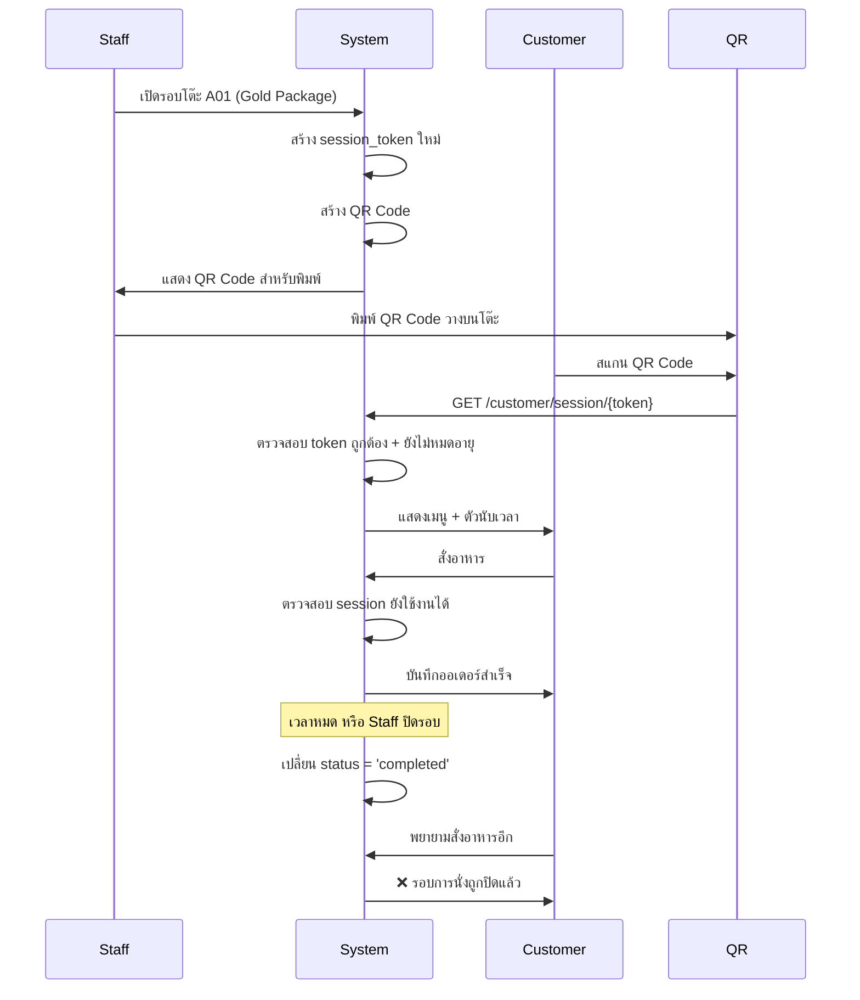

# QR Code Security & Session-Based Access

## ปัญหา
QR Code แบบเดิมที่ติดโต๊ะถาวร สามารถถูกนำไปใช้สั่งอาหารได้แม้ไม่ได้นั่งโต๊ะนั้น ทำให้เกิดการสั่งแกล้งได้

## วิธีแก้ไข: Session-Based QR Code

### 1. Database Schema Update

เพิ่มฟิลด์ใน `customer_sessions` table:

```sql
ALTER TABLE customer_sessions ADD COLUMN session_token VARCHAR(255) UNIQUE;
ALTER TABLE customer_sessions ADD COLUMN token_expires_at TIMESTAMP;
CREATE INDEX idx_sessions_token ON customer_sessions(session_token);
```

### 2. QR Code Generation Logic

#### เมื่อ Staff เปิดรอบใหม่:
1. สร้าง `session_token` แบบ random (UUID + timestamp + secret)
2. ตั้ง `token_expires_at` = เวลาหมดรอบการทาน + buffer (เช่น 30 นาที)
3. สร้าง QR Code ที่มี URL: `https://restaurant.com/customer/session/{session_token}`
4. พิมพ์ QR Code ใหม่ทุกครั้ง

#### ตัวอย่าง Code (Backend):
```typescript
// sessions.service.ts
async startSession(data: StartSessionDto) {
  // Generate unique session token
  const sessionToken = this.generateSecureToken();
  
  // Calculate expiration (time_limit + 30 min buffer)
  const expiresAt = new Date();
  expiresAt.setMinutes(expiresAt.getMinutes() + data.time_limit_minutes + 30);
  
  const session = await this.sessionsRepository.create({
    ...data,
    session_token: sessionToken,
    token_expires_at: expiresAt,
    start_time: new Date(),
    status: 'active'
  });
  
  // Generate QR Code
  const qrUrl = `${process.env.FRONTEND_URL}/customer/session/${sessionToken}`;
  const qrCodeImage = await this.qrService.generate(qrUrl);
  
  return {
    session_id: session.id,
    session_token: sessionToken,
    qr_url: qrUrl,
    qr_code_image: qrCodeImage, // Base64 or file path
    expires_at: expiresAt
  };
}

private generateSecureToken(): string {
  const uuid = uuidv4();
  const timestamp = Date.now();
  const random = crypto.randomBytes(16).toString('hex');
  return `${uuid}-${timestamp}-${random}`;
}
```

### 3. Customer Access Validation

#### API Endpoint: GET /customer/session/:sessionToken

```typescript
// customer.controller.ts
@Get('session/:sessionToken')
async getSession(@Param('sessionToken') token: string) {
  const session = await this.sessionsService.findByToken(token);
  
  // Validation checks
  if (!session) {
    throw new NotFoundException('ไม่พบรอบการนั่งนี้');
  }
  
  if (session.status !== 'active') {
    throw new BadRequestException('รอบการนั่งนี้ถูกปิดแล้ว');
  }
  
  if (new Date() > session.token_expires_at) {
    throw new BadRequestException('QR Code หมดอายุแล้ว');
  }
  
  // Return session data + menus
  return {
    session: {
      id: session.id,
      table_number: session.table.table_number,
      package: session.package,
      start_time: session.start_time,
      time_limit_minutes: session.time_limit_minutes,
      minutes_remaining: this.calculateMinutesRemaining(session)
    },
    menus: await this.menusService.getMenusByPackage(session.package_id)
  };
}
```

#### API Endpoint: POST /customer/session/:sessionToken/orders

```typescript
@Post('session/:sessionToken/orders')
async placeOrder(
  @Param('sessionToken') token: string,
  @Body() orderData: CreateOrderDto
) {
  const session = await this.validateActiveSession(token);
  
  // Additional check: prevent ordering after time limit
  const minutesRemaining = this.calculateMinutesRemaining(session);
  if (minutesRemaining <= 0) {
    throw new BadRequestException('เวลาในการทานหมดแล้ว ไม่สามารถสั่งเพิ่มได้');
  }
  
  // Create order
  return await this.ordersService.create({
    session_id: session.id,
    ...orderData
  });
}

private async validateActiveSession(token: string) {
  const session = await this.sessionsService.findByToken(token);
  
  if (!session || session.status !== 'active') {
    throw new BadRequestException('ไม่สามารถสั่งอาหารได้ รอบการนั่งไม่ถูกต้อง');
  }
  
  if (new Date() > session.token_expires_at) {
    throw new BadRequestException('QR Code หมดอายุแล้ว');
  }
  
  return session;
}
```

### 4. QR Code Printing Workflow

#### หน้า Staff UI:
```typescript
// StartSessionModal.tsx
const handleStartSession = async () => {
  const response = await api.post('/staff/sessions/start', {
    table_id: selectedTable.id,
    package_id: selectedPackage.id,
    num_adults: numAdults,
    num_children: numChildren
  });
  
  // Show QR Code for printing
  setQrCodeImage(response.data.qr_code_image);
  setShowPrintDialog(true);
};

const handlePrint = () => {
  // Print QR Code
  const printWindow = window.open('', '_blank');
  printWindow.document.write(`
    <html>
      <head>
        <title>QR Code - โต๊ะ ${tableNumber}</title>
        <style>
          body { 
            display: flex; 
            flex-direction: column;
            align-items: center; 
            justify-content: center;
            height: 100vh;
            font-family: 'Sarabun', sans-serif;
          }
          img { width: 300px; height: 300px; }
          .info { text-align: center; margin-top: 20px; }
          .table { font-size: 24px; font-weight: bold; }
          .package { font-size: 18px; color: #666; }
          .warning { font-size: 14px; color: #e74c3c; margin-top: 10px; }
        </style>
      </head>
      <body>
        
        <div class="info">
          <div class="table">โต๊ะ ${tableNumber}</div>
          <div class="package">${packageName}</div>
          <div class="warning">⚠️ QR Code นี้ใช้ได้เฉพาะรอบนี้เท่านั้น</div>
        </div>
      </body>
    </html>
  `);
  printWindow.document.close();
  printWindow.print();
};
```

### 5. Session Lifecycle



### 6. Security Features

#### ✅ ป้องกันการใช้ซ้ำ:
- QR Code ใช้ได้เฉพาะ session เดียว
- เมื่อปิดรอบ (`status = 'completed'`) ไม่สามารถสั่งอาหารได้อีก

#### ✅ ป้องกันการใช้หลังหมดเวลา:
- มี `token_expires_at` ตรวจสอบ
- ตรวจสอบ `minutes_remaining` ก่อนรับออเดอร์

#### ✅ ป้องกันการเดา Token:
- ใช้ UUID + timestamp + random bytes
- Token ยาวและซับซ้อน

#### ✅ Rate Limiting (เพิ่มเติม):
```typescript
// ป้องกัน spam orders
@UseGuards(ThrottlerGuard)
@Throttle(10, 60) // 10 requests per 60 seconds
@Post('session/:sessionToken/orders')
async placeOrder(...) {
  // ...
}
```

### 7. Updated API Documentation

#### POST /staff/sessions/start
**Response:**
```json
{
  "success": true,
  "data": {
    "session_id": "uuid",
    "session_token": "abc123-1234567890-xyz789",
    "table_number": "A01",
    "package_name": "Gold Buffet",
    "start_time": "2023-11-30T12:00:00Z",
    "time_limit_minutes": 120,
    "token_expires_at": "2023-11-30T14:30:00Z",
    "qr_url": "https://restaurant.com/customer/session/abc123-1234567890-xyz789",
    "qr_code_image": "data:image/png;base64,iVBORw0KG..."
  }
}
```

#### GET /customer/session/:sessionToken
**Error Responses:**
```json
// Token ไม่ถูกต้อง
{
  "success": false,
  "error": {
    "code": "NOT_FOUND",
    "message": "ไม่พบรอบการนั่งนี้"
  }
}

// Session ถูกปิดแล้ว
{
  "success": false,
  "error": {
    "code": "SESSION_CLOSED",
    "message": "รอบการนั่งนี้ถูกปิดแล้ว กรุณาติดต่อพนักงาน"
  }
}

// Token หมดอายุ
{
  "success": false,
  "error": {
    "code": "TOKEN_EXPIRED",
    "message": "QR Code หมดอายุแล้ว กรุณาขอ QR Code ใหม่จากพนักงาน"
  }
}

// หมดเวลาทาน
{
  "success": false,
  "error": {
    "code": "TIME_LIMIT_EXCEEDED",
    "message": "เวลาในการทานหมดแล้ว ไม่สามารถสั่งอาหารเพิ่มได้"
  }
}
```

### 8. Frontend Customer Page

```typescript
// app/customer/session/[token]/page.tsx
export default function CustomerMenuPage({ params }: { params: { token: string } }) {
  const [session, setSession] = useState(null);
  const [error, setError] = useState(null);
  
  useEffect(() => {
    loadSession();
  }, [params.token]);
  
  const loadSession = async () => {
    try {
      const response = await fetch(`/api/customer/session/${params.token}`);
      
      if (!response.ok) {
        const error = await response.json();
        setError(error.error.message);
        return;
      }
      
      const data = await response.json();
      setSession(data.data);
    } catch (err) {
      setError('ไม่สามารถโหลดข้อมูลได้ กรุณาลองใหม่อีกครั้ง');
    }
  };
  
  if (error) {
    return (
      <div className="error-page">
        <h1>❌ {error}</h1>
        <p>กรุณาติดต่อพนักงานเพื่อขอความช่วยเหลือ</p>
      </div>
    );
  }
  
  if (!session) {
    return <LoadingSpinner />;
  }
  
  return (
    <div className="customer-menu">
      <Header session={session} />
      <MenuGrid menus={session.menus} />
      <Cart sessionToken={params.token} />
    </div>
  );
}
```

### 9. Benefits

✅ **ความปลอดภัย**: ไม่สามารถใช้ QR Code เก่าสั่งอาหารได้  
✅ **ควบคุมได้**: Staff ควบคุมการเปิด-ปิดรอบการสั่ง  
✅ **ป้องกันการแกล้ง**: ต้องมี session ที่ active จริงถึงจะสั่งได้  
✅ **Audit Trail**: รู้ว่า session ไหนสั่งอะไรไปบ้าง  
✅ **Time Control**: ไม่ให้สั่งหลังหมดเวลา  

### 10. Implementation Checklist

- [ ] อัปเดต database schema เพิ่ม `session_token` และ `token_expires_at`
- [ ] สร้าง function `generateSecureToken()`
- [ ] แก้ไข `/staff/sessions/start` ให้สร้าง token และ QR Code
- [ ] แก้ไข `/customer/session/:sessionToken` ให้ validate token
- [ ] เพิ่ม validation ใน order placement
- [ ] สร้าง UI สำหรับพิมพ์ QR Code
- [ ] เพิ่ม error handling สำหรับ token หมดอายุ
- [ ] เพิ่ม rate limiting
- [ ] ทดสอบ flow ทั้งหมด
- [ ] อัปเดต documentation

---

**สรุป**: ระบบใหม่จะสร้าง QR Code ใหม่ทุกครั้งที่เปิดรอบ และ QR Code นั้นจะใช้ได้เฉพาะรอบนั้นเท่านั้น ป้องกันการนำ QR Code เก่าไปใช้สั่งแกล้งได้อย่างมีประสิทธิภาพ 🔒
